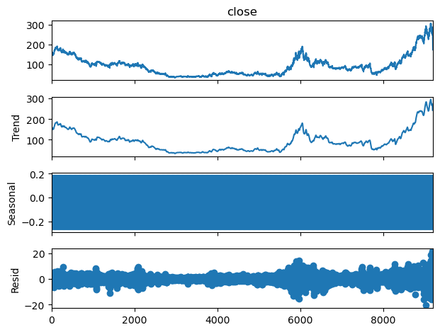
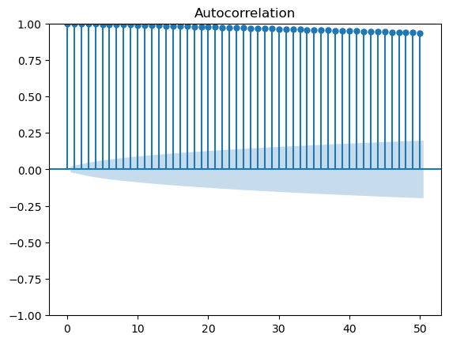
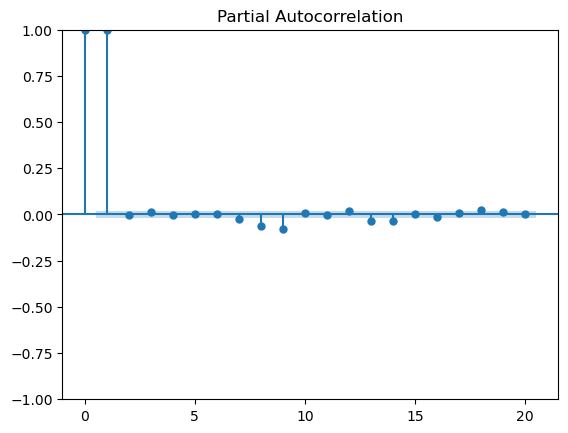
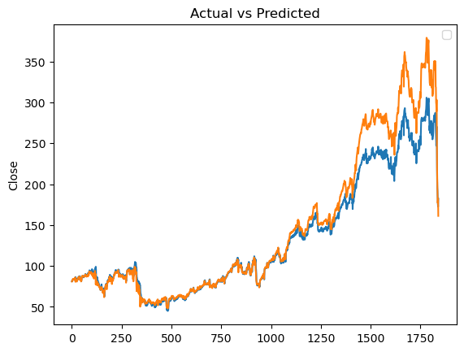
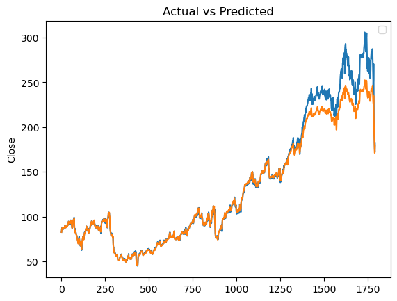

# 株価予測モデルの構築
### 使用したパッケージ
#### pandas,matplotlib,statsmodels,sklearn
これらはAnaconda3にデフォルトでインストールされています。
#### Pytorch
```
conda install pytorch torchvision torchaudio cpuonly -c pytorch
```

### プログラムの概要
LSTM (Long Short-Term Memory)を使用した株価予想モデルを構築し、NTT株価の過去のデータを用いて、終値を予想した。

### 環境
- VSCode：1.95.1
- Anaconda3：24.9.2
- Python：3.12.7

#### データの読み込み・変換
```
date  close   open   high    low        volume  change_rate
0    2024-08-01  156.3  159.3  159.4  156.1  7.915000e+07      -0.0256
1    2024-07-31  160.4  158.2  160.7  158.1  1.739100e+08       0.0107
2    2024-07-30  158.7  158.8  159.2  158.0  1.381400e+08      -0.0063
3    2024-07-29  159.7  158.7  160.2  158.4  1.262800e+08       0.0114
4    2024-07-26  157.9  159.3  159.6  157.9  1.550800e+08      -0.0013
...         ...    ...    ...    ...    ...           ...          ...
9197 1987-02-18  191.2  186.3  191.2  186.3  7.950900e+08       0.0482
9198 1987-02-17  182.4  176.5  184.3  175.5  8.815100e+08       0.0393
9199 1987-02-16  175.5  166.7  175.5  165.7  3.605100e+08       0.0174
9200 1987-02-13  172.5  176.5  176.5  172.5  4.223800e+08      -0.0543
9201 1987-02-12  182.4  182.4  182.4  182.4  1.280000e+09       0.1625

[9202 rows x 7 columns]
```
- 日付けをdate型として、その他の項目を訓練データ・テストデータに使用できるようfloat型としてDataFrameに取り込んだ。

#### データの理解とEDA
```
基本統計量
                                date        close         open         high  \
count                           9202  9202.000000  9202.000000  9202.000000   
mean   2005-10-21 08:44:04.642469248    92.180961    92.256183    93.176451   
min              1987-02-12 00:00:00    33.000000    33.000000    33.200000   
25%              1996-06-06 06:00:00    52.000000    52.100000    52.800000   
50%              2005-10-11 12:00:00    85.100000    85.100000    86.050000   
75%              2015-03-04 18:00:00   110.800000   110.800000   111.900000   
max              2024-08-01 00:00:00   305.900000   309.800000   311.800000   
std                              NaN    50.452228    50.598215    51.049837   

               low        volume  change_rate  
count  9202.000000  9.202000e+03  9202.000000  
mean     91.330146  1.726677e+08     0.000175  
min      32.200000  9.340000e+06    -0.147400  
25%      51.500000  8.073000e+07    -0.009400  
50%      84.200000  1.540150e+08     0.000000  
75%     109.275000  2.305225e+08     0.009000  
max     303.900000  1.280000e+09     0.162500  
std      50.087405  1.251280e+08     0.018767  
```
- 基本統計量の確認を行った。
    - 終値,始値,高値,安値の基本統計量はどれも近い値を取っている。
    - 終値,始値,高値,安値はどれも、だいたい92±50の範囲に収まる。
    - 平均92に対して、最高値は300と大きな値を取っており、外れ値の補正をする必要がある可能性がある。

```
欠損値の数
date           0
close          0
open           0
high           0
low            0
volume         0
change_rate    0
dtype: int64
```
- 欠損値の確認を行い、どの項目も存在しなかったので処理は実装していない。
  

- トレンド・季節性の確認を行った。
  - トレンドが確認でき、非定常性であることが分かった。
  - 1か月間(period=20)では、季節性は確認できなかった。



- 強い自己相関が確認できた。
  - また、偏自己相関から関係が強いのは1,2日前である。

#### データ前処理と特徴量エンジニアリング
- 特徴量として、ラグ(1日)を追加した。
- 特徴量の追加により、生じた欠損値はdropnaメソッドにより補完した。
- データ前処理として、正規化を行い、訓練用とテスト用にデータを分割した。

#### モデル選定とトレーニング
- 予想モデルとしてLSTMを用いた。これらを用いた理由は以下の通り。
  - 自己相関が強い。
  - 季節性が確認できなかったため、SARIMAなどを使う必要はない。
  - torchでは、ARIMAは構築できない。
- また、評価指標として、MAE,RMSE,R2を用いた。

###### LSTM
```
epoch：10/100,loss:0.01127451378852129
epoch：20/100,loss:0.009180421009659767
epoch：30/100,loss:0.008849019184708595
epoch：40/100,loss:0.007852097041904926
epoch：50/100,loss:0.006659115198999643
epoch：60/100,loss:0.004817881155759096
epoch：70/100,loss:0.0023891511373221874
epoch：80/100,loss:0.000390864530345425
epoch：90/100,loss:0.00019825660274364054
epoch：100/100,loss:0.00016650067118462175
MAE：13.920321 RMSE：24.198103 R2：0.880161702632904
```


#### 改善策の検討とモデルの再トレーニング
###### 改善点
特徴量やLSTMに用いるパラメーターを手動で決めており、最適化されていない。
- 特徴量の選定には、RFE(Recursive Feature Elimination)を用いた。
- ハイパーパラメーターチューニングを構築し、パラメーターを定めた。

#### 改良型LSTM
```
epoch：10/100,loss:0.005377559922635555
epoch：20/100,loss:0.001367695047520101
epoch：30/100,loss:0.0004826980293728411
epoch：40/100,loss:0.000103978585684672
epoch：50/100,loss:5.046262594987638e-05
epoch：60/100,loss:2.0786706954822876e-05
epoch：70/100,loss:1.3901019883633126e-05
epoch：80/100,loss:9.997181223297957e-06
epoch：90/100,loss:7.64744163461728e-06
epoch：100/100,loss:6.231191036931705e-06
MAE：6.2837553 RMSE：12.674932 R2：0.9675644636154175
```

- MAE, RMSE, R2ともに改良前より、評価がよくなった。

### 参考にした書籍・サイト
##### サイト
- [探索的データ分析（EDA）完全ガイド：2024年版](https://qiita.com/futakuchi0117/items/0e4f2380d432a442b22d)
- [Pythonのstatsmodelsで時系列データをトレンド、季節性、残差に分解する](https://qiita.com/shinji_komine/items/9dbada69b9128f645660)
- [機械学習を学ぶ](https://programming-cafe.com/category/programming/python-programming/study-machine-learning/)
- [pandasで時系列データの補間をマスター！欠損値処理の基本と応用](https://machine-learning-skill-up.com/knowledge/pandas%E3%81%A7%E6%99%82%E7%B3%BB%E5%88%97%E3%83%87%E3%83%BC%E3%82%BF%E8%A3%9C%E5%AE%8C)
- [【TradingView】出来高の単位「K」「M」「B」の読み方](https://marketview.jp/tradingview-volume-unit#google_vignette)
- [ゴールデンクロスとは｜意味・売買シグナル・注意点などを詳しく解説](https://www.oanda.jp/lab-education/technical_analysis/moving_average/golden_cross_dead_cross/)
- [【分析】時系列分析の基礎を理解する](https://qiita.com/Takahiro_zzz/items/c48a925847cba9955439)
- [【徹底解説】PyTorchにおけるレイヤ定義：__ init__()とforward()の違い](https://python-jp.dev/articles/300127417)
- [【実践編】PyTorchでLSTMネットワークを使ってモデルを構築して学習させる](https://python-jp.dev/articles/260750715)
- [Pytorchでクラス継承のsuper()の引数は省略できる](https://tzmi.hatenablog.com/entry/2019/12/31/002627)
- [Pytorch/Docs](https://pytorch.org/docs/stable/index.html)
- [【決定版】スーパーわかりやすい最適化アルゴリズム -損失関数からAdamとニュートン法-](https://qiita.com/omiita/items/1735c1d048fe5f611f80)
- [Pytorchの損失関数(Loss Function)の使い方および実装まとめ](https://qiita.com/lucasta1/items/3e0e4306940fc35e0af1)
- [PyTorchによる基本的実装まとめ](https://qiita.com/shun310/items/3fbac0a6cf87a0d70b78)
- [PyTorchモデルを変更して推論を実行し、その後トレーニングを再開する方法の詳細ガイド](https://python-jp.dev/articles/357721356)
- [【入門者向け】特徴量選択の基本まとめ(scikit-learnときどきmlxtend)](https://qiita.com/FukuharaYohei/items/db88a8f4c4310afb5a0d)
- [ハイパーパラメータとは？チューニングの手法を徹底解説（XGBoost編）](https://www.codexa.net/hyperparameter-tuning-python/)
- [【０から学ぶAI】第56回：ハイパーパラメータチューニング 〜モデルの性能を最適化するための調整方法を説明](https://service.ai-prompt.jp/article/ai365-056/)
- [天使か悪魔か アルゴ取引【経済コラム】](https://www3.nhk.or.jp/news/html/20241004/k10014599731000.html)

##### 書籍
- Pythonでできる!株価データ分析
- 時系列解析：自己回帰型モデル・状態空間モデル・異常検知
- 時系列解析入門